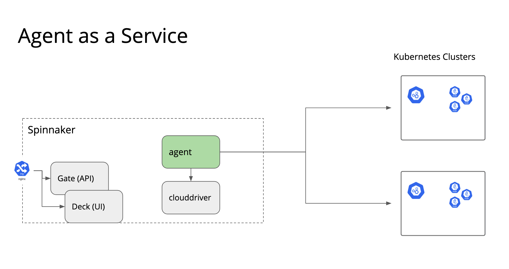
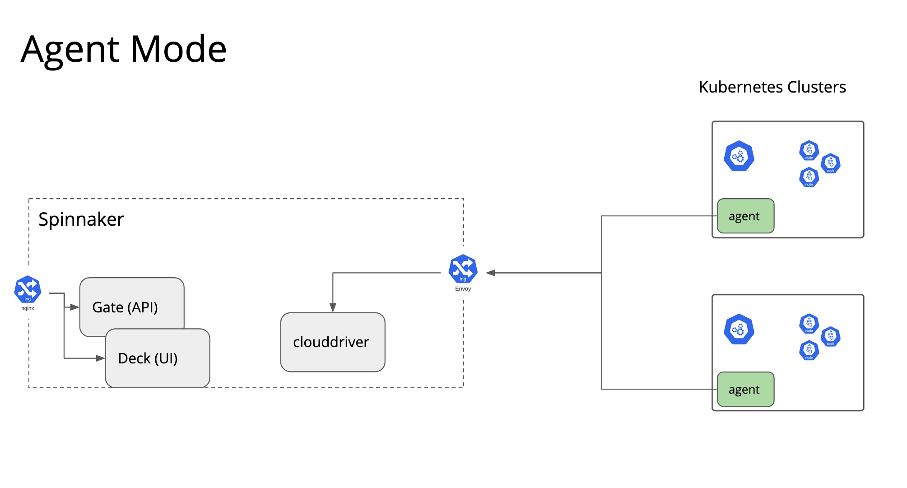

# Agent capabilities

Under content:

```
content
├── agent-infra
│   ├── clouddriver-grpc-ingress.yaml
│   ├── envoy
│   └── kustomization.yaml
├── infra
│   ├── agent-deployment
│   ├── install.sh
│   ├── kubecfgs
│   └── tf
├── ingress.yaml
├── kustomization.yaml
├── local
│   ├── agent.sh
│   └── conf
└── spinnaker
    ├── agent
    ├── agent-plugin
    ├── kustomization.yaml
    ├── pipelines
    └── spinsvc.yaml

```


We only start with `content/kustomization.yaml` pointing to `spinnaker/` + `ingress`.


Prereq:
- Add a file name `kubecfg-dev.yaml` to `content/local/conf/kubecfgs`  and `content/spinnaker/agent/kubecfgs` to point to k8s clusters for respectively infra and service mode.
- Access to a GCP account to add Kubernetes accounts. Modify the TF script for other provider.
- Generate the certificates with `content/agent-infra/envoy/cert/gen.sh`


## Service mode



Uncomment `agent` in `content/spinnaker/kustomization.yaml`

## Infra mode


Uncomment `agent-infra` in `content/kustomization.yaml` to install Envoy.
`content/local/agent.sh` runs the agent locally.

## Agent mode


In this mode, we install the agent in pre-existing clusters.


